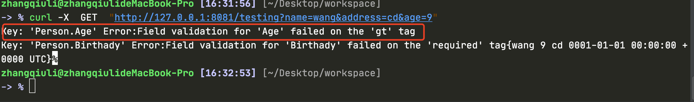

# 中文文档

https://learnku.com/docs/gin-gonic/2018/gin-readme/3819

# 获取使用

```
go mod init gin_test 

go get -v github.com/gin-gonic/gin@v1.4
```

Start

```
package main

import (
	"github.com/gin-gonic/gin"
)
func main()  {
	r := gin.Default()
	r.GET("/ping",func(g *gin.Context){
		g.JSON(200,gin.H{
			"message":"pong",
		})
	})
	r.Run()
}
```

默认8080


# 请求路由


- 多种请求类型
- **绑定静态**文件夹
- 参数作为URL,多用于restful请求中
- 泛绑定


<font color=red>多种请求</font>

```
package main

import (
	"github.com/gin-gonic/gin"
)
func main()  {
	r := gin.Default()
	r.GET("/get",func(g *gin.Context){
		g.JSON(200,gin.H{
			"message":"get",
		})
	})
	//post
	r.POST("/post",func(g *gin.Context){
		g.String(200,"post")
	})
	//delete
	r.Handle("DELETE","/delete",func(g *gin.Context){
		g.String(200,"delete")
	})

	r.Run()
}
```


==any==

```
	//Any 支持8中
	r.Any("/any",func(g *gin.Context){
		g.String(200,"any")
	})
```


# 静态文件夹绑定

```
package main

import (
	"github.com/gin-gonic/gin"
	"net/http"
)
func main()  {
	r := gin.Default()
	//设置静态文件夹
	r.Static("assets","../asset")
	//设置静态文夹
	r.StaticFS("/static",http.Dir("static"))
	//设置静态文件
	r.StaticFile("/favicon.ico","./favicon.ico")

	r.Run()
}
```


go build -o main && ./main


#  参数作为URL

```
package main

import (
	"fmt"
	"github.com/gin-gonic/gin"
)
func main()  {
	r := gin.Default()
	//参数作为URL
	r.GET("/:name/:id",func(g *gin.Context){
		g.JSON(200,gin.H{
			"name":g.Param("name"),
			"id":g.Param("id"),
		})
	})
fmt.Println(gin.Params{})
	r.Run(":8081")
}
```


curl -X  GET  "http://127.0.0.1:8081/zhangsan/89"

结果

{"id":"89","name":"zhangsan"}%


# 获取请求参数

## 泛绑定

```
package main

import (
	"github.com/gin-gonic/gin"
)
func main()  {
	r := gin.Default()
	//泛绑定
	r.GET("/user/*action",func(g *gin.Context){
		g.String(200,"hello world")
	})
	r.Run(":8081")
}
```


## get 默认值

```
package main

import (
	"github.com/gin-gonic/gin"
	"net/http"
)
func main()  {
	r := gin.Default()
	//获取get参数 非默认值和默认值
	r.GET("/test",func(g *gin.Context){
		queryName := g.Query("first_name")
		defaultName := g.DefaultQuery("last_name","defaultName")
		g.String(http.StatusOK,"%s,%s",queryName,defaultName)
	})
	r.Run(":8081")
}
```


## 获取body内容

```
package main

import (
	"github.com/gin-gonic/gin"
	"io/ioutil"
	"net/http"
)
func main()  {
	r := gin.Default()
	//获取body参数
	r.POST("/test",func(g *gin.Context){
		bodyBytes,err := ioutil.ReadAll(g.Request.Body)
		if nil != err{
			g.String(http.StatusOK,err.Error())
			g.Abort()//结束请求
		}
		g.String(http.StatusOK,string(bodyBytes))
	})
	r.Run(":8081")
}
```


 curl -X  POST  "http://127.0.0.1:8081/test" -d '{"name":"zhangsan"}'
{"name":"zhangsan"}%  


==当readall后取不到postForm的数据==

Ioutil.readall 读取后再次放入请求 的body中

```
package main

import (
	"bytes"
	"github.com/gin-gonic/gin"
	"io/ioutil"
	"net/http"
)
func main()  {
	r := gin.Default()
	//获取body参数
	r.POST("/test",func(g *gin.Context){
		bodyBytes,err := ioutil.ReadAll(g.Request.Body)
		if nil != err{
			g.String(http.StatusOK,err.Error())
			g.Abort()//结束请求
		}
		//读取完结果在回存到request。body中
		g.Request.Body = ioutil.NopCloser(bytes.NewBuffer(bodyBytes))
		firstName := g.PostForm("first_name")
		defaultName := g.DefaultPostForm("last_name","default_name")
		g.String(http.StatusOK,"%s,%s,%s",firstName,defaultName,string(bodyBytes))
	})
	r.Run(":8081")
}
```


# 参数绑定到结构体

json的也可以

curl -H "Content-Type:application/json" -X POST 'http://127.0.0.1:8081/testing' -d 'name=zahngdan&address=bj'

```
package main

import (
	"github.com/gin-gonic/gin"
	"net/http"
	"time"
)
type Person struct{
	Name string `form:"name"`
	Address string `form:"address"`
	Birthady time.Time `form:"birthady"`
}
func main()  {
	r := gin.Default()
	r.GET("/testing",testing)
	r.POST("/testing",testing)

	r.Run(":8081")
}

func testing(g *gin.Context){
	var person Person
	//接受的是interface，根据不同的context-type来做不同的绑定
	if err := g.ShouldBind(&person);nil != err{
		g.String(http.StatusOK,err.Error())
	}
	g.String(http.StatusOK,"%v",person)
}
```


# 验证请求参数

支持的规则

https://github.com/go-playground/validator


将验证规则定义到结构题的tag中

```
package main

import (
	"github.com/gin-gonic/gin"
	"net/http"
	"time"
)
type Person struct{
	Name string `form:"name" binding:"required"`
	Age int `form:"age" binding:"required,gt=10"`
	//Name string `form:"name" bind:"required|gt=10"`如果只需要满足一点就｜分割
	Address string `form:"address" binding:"required"`
	Birthady time.Time `form:"birthady" binding:"required"`
}
func main()  {
	r := gin.Default()
	r.GET("/testing",testing)

	r.Run(":8081")
}

func testing(g *gin.Context){
	var person Person
	//接受的是interface，根据不同的context-type来做不同的绑定
	if err := g.ShouldBind(&person);nil != err{
		g.String(500,err.Error())
	}
	g.String(http.StatusOK,"%v",person)
}
```

curl -X  GET  "http://127.0.0.1:8081/testing?name=wang&address=cd&age=9" 




# 自定义验证

```
package main

import (
	"github.com/gin-gonic/gin"
	"github.com/gin-gonic/gin/binding"
	"gopkg.in/go-playground/validator.v8"
	"net/http"
	"reflect"
	"time"
)

type Booking struct {
	CheckIn time.Time `form:"check_in" binding:"required,bookabledata" time_format:"2006-01-02"`
	CheckOut time.Time `form:"check_out" binding:"required,gtfield=CheckIn" time_format:"2006-01-02"`
}

func main()  {

	//注册验证器
	if v,ok:= binding.Validator.Engine().(*validator.Validate);ok{
		v.RegisterValidation("bookabledata",bookableDate)
	}
	r := gin.Default()
	r.GET("bookable",func(g *gin.Context){
		var b Booking
		if err:= g.ShouldBind(&b);nil != err{
			g.JSON(500,gin.H{"err":err.Error()})
			return
		}
		g.JSON(http.StatusOK,gin.H{"message":"ok"})
	})

	r.Run(":8081")
}

func bookableDate(v *validator.Validate,topStruct reflect.Value,currentStructField reflect.Value,field reflect.Value,fieldType reflect.Type,fieldKind reflect.Kind,param string)bool{
	if data,ok := field.Interface().(time.Time);ok{
		toDay := time.Now()
		if data.Unix() < toDay.Unix(){
			return true
		}
	}
	return false
}


```

curl -X  GET  "http://127.0.0.1:8081/bookable?check_in=2020-06-26&check_out=2020-06-27" 


# 验证信息多语言化


# 中间件

==logger==

```
package main

import (
	"github.com/gin-gonic/gin"
	"net/http"
)

func main(){
	// 默认 调用了 两个中间件
	//	engine := New()
	//	engine.Use(Logger(), Recovery())
	//r := gin.Default()
	r := gin.New()
	//默认在控制台输出
	r.Use(gin.Logger())
	r.GET("/test",func(g *gin.Context){
		name := g.DefaultQuery("name","default_name")
		g.String(http.StatusOK,"%s",name)
	})
	r.Run()
}

```

curl -X  GET  "http://127.0.0.1:8080/test?name=zhangsan"


<font size=5x color=red>日志记录文件</font>

```
package main

import (
	"github.com/gin-gonic/gin"
	"io"
	"net/http"
	"os"
)

func main(){
	// 默认 调用了 两个中间件
	//	engine := New()
	//	engine.Use(Logger(), Recovery())
	//r := gin.Default()

	//默认在控制台输出，自定义输出位置
	f ,_:= os.Create("gin.log")
	gin.DefaultWriter= io.MultiWriter(f)
	gin.DefaultErrorWriter = io.MultiWriter(f)

	r := gin.New()
	r.Use(gin.Logger())
	r.GET("/test",func(g *gin.Context){
		name := g.DefaultQuery("name","default_name")
		g.String(http.StatusOK,"%s",name)
	})
	r.Run()
}

```


## recovery

正常可以记录一下日志


# 自定义ip白名单中间件

```
package main

import (
	"github.com/gin-gonic/gin"
	"io"
	"net/http"
	"os"
)

func IPAuthMiddleware() gin.HandlerFunc{
	return func(g *gin.Context) {
		iplist := []string{
			"127.0.0.2",
		}
		flag := false
		clientIp := g.ClientIP()
		for _,host := range iplist{
			if host == clientIp{
				flag = true
				break
			}
		}
		if !flag{
			g.String(401,"%s","not in ipList")
			g.Abort()
			return
		}
	}
}

func main(){
	// 默认 调用了 两个中间件
	//	engine := New()
	//	engine.Use(Logger(), Recovery())
	//r := gin.Default()

	//默认在控制台输出，自定义输出位置
	f ,_:= os.Create("gin.log")
	gin.DefaultWriter= io.MultiWriter(f)
	gin.DefaultErrorWriter = io.MultiWriter(f)

	r := gin.New()
	r.Use(gin.Logger())
	//补货panic，防止程序异常退出
	r.Use(gin.Recovery())
	//自定义中间件
	r.Use(IPAuthMiddleware())
	r.GET("/test",func(g *gin.Context){
		name := g.DefaultQuery("name","default_name")
		g.String(http.StatusOK,"%s",name)
	})
	r.Run()
}

```


# 优雅关停

```
package main

import (
	"context"
	"github.com/gin-gonic/gin"
	"log"
	"net/http"
	"os"
	"os/signal"
	"syscall"
	"time"
)

func main(){
	r := gin.Default()
	r.GET("/test",func(g * gin.Context){
		time.Sleep(10*time.Second)
		g.String(http.StatusOK,"ok")
	})
	//使用http监听
	srv := &http.Server{
		Addr: ":8085",
		Handler: r,
	}
	//异常退出或者服务停止
	go func(){
		if err := srv.ListenAndServe();err!=nil && err != http.ErrServerClosed{
			log.Fatalf("listen:%s\n",err)
		}
	}()
	//创建 ctrl+c等的结果的chan
	quit := make(chan os.Signal)
	//监听信号并放入chan
	signal.Notify(quit,syscall.SIGINT,syscall.SIGTERM)
	//阻塞chan
	<-quit
	log.Println("shutdown server...")
	//创建上下文，10秒的超时等待
	ctx,cancel:=context.WithTimeout(context.Background(),10*time.Second)
	defer cancel()
	//监听到停止信号输出
	if err :=srv.Shutdown(ctx);err!=nil{
		log.Fatal("server shutdown:",err)
	}
	log.Println("server down")
}
```

curl -X  GET  "http://127.0.0.1:8085/test?name=zhangsan" 


# 模版渲染

```
package main

import (
	"github.com/gin-gonic/gin"
	"net/http"
)

func main(){
	r := gin.Default()
	r.LoadHTMLGlob("../template/*")
	r.GET("/index",func(g *gin.Context){
		g.HTML(http.StatusOK,"index.html",gin.H{
			"title":"index.html",
		})
	})
	r.Run()
}
```

curl -X  GET  "http://127.0.0.1:8080/index" 
<html>
<head>
    <meta charset="UTF-8">
    <meta name="viewport"
          content="width=device-width, user-scalable=no, initial-scale=1.0, maximum-scale=1.0, minimum-scale=1.0">
    <meta http-equiv="X-UA-Compatible" content="ie=edge">
    <title>Document</title>
</head>
<body>
 ssss
</body>
</html>%                                                                                                                 zhangqiuli@zhangqiulideMacBook-Pro [18:43:23] [~/Desktop/workspace] 
-> % 

# 自动配置证书

```
package main

import (
	"github.com/gin-gonic/gin"
	"github.com/gin-gonic/autotls"
	"net/http"
)

func main(){
	r := gin.Default()
	r.LoadHTMLGlob("../template/*")
	r.GET("/index",func(g *gin.Context){
		g.HTML(http.StatusOK,"index.html",gin.H{
			"title":"index.html",
		})
	})
	//r.Run()
	autotls.Run(r,"www.123.com")

}

```


